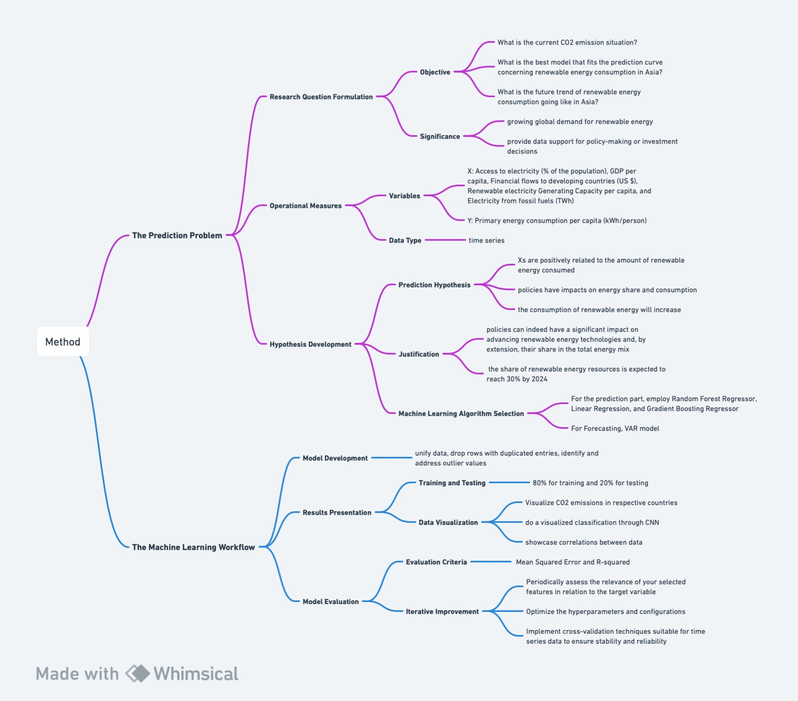
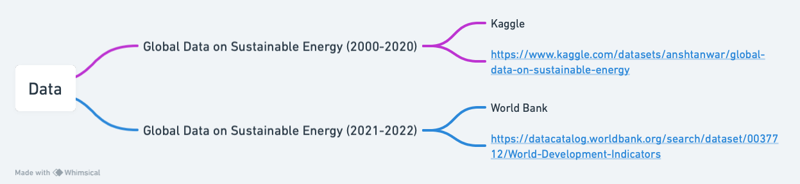
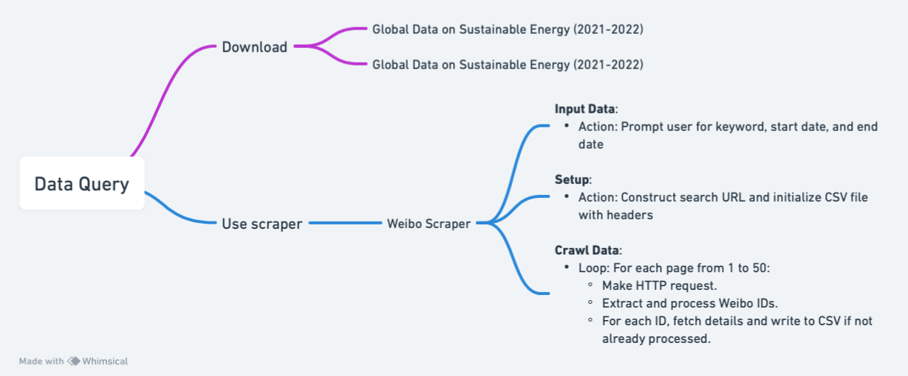
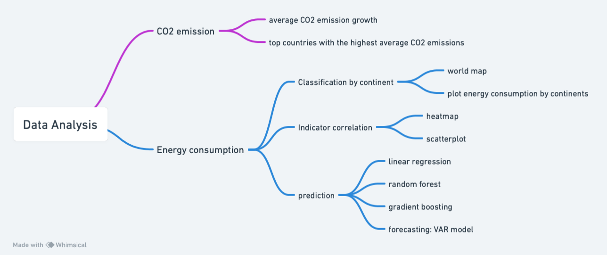

# Harnessing Machine Learning for Understanding Global Energy and Predicting Renewable Energy Consumption Trends in Asia
## Project information
- **Author**:Yiming Yuan, Applied Mathematics and Computer Science, Class of 2025, Duke Kunshan University
- **Instructor**: Prof. Luyao Zhang, Duke Kunshan University
- **Disclaimer**: Submissions to the Final Project for [STATS201 Introduction to Machine Learning for Social Science, 2023 Autumn Term (Seven Week - Second)](https://ms.pubpub.org/) instructed by Prof. Luyao Zhang at Duke Kunshan University.
- **Acknowledgments**: I would like to thank Prof. Luyao Zhang for her detailed and enthusiastic instructions on machine learning methods and the constructive comments on my research design and implementation. Thanks to all of my classmates for their tips on my data analysis methods and their peer evaluation which helped me improve my work. Thanks for the wonderful class atmosphere!
- **Project Summary**: 
  - **Background/Motivation**
    
    Global CO2 emissions from energy combustion and industrial processes grew by 0.9% or 321 Mt in 2022, reaching up to a new all-time high of 36.8 Gt (IEA 2023). However, Emissions need to fall to 9.7 Gt in 2050 for an emissions pathway compatible with the 2 °C target of the Paris Agreement (Gielen et al. 2019). Renewable energy makes up most of the emission reductions. Therefore, with the growing global demand for renewable energy, understanding the main factors affecting energy consumption becomes crucial. The proliferation of renewable energy is essential for achieving climate targets, reducing dependence on fossil fuels, and promoting sustainable economic development.
    
  - **Research Questions**
    1. What is the current CO2 emission situation globally?
    2. Which is the best model, among linear regression, random forest, and gradient boosting, that fits the prediction curve concerning renewable energy consumption in Asia?
    3. What is the trend of renewable energy consumption in Asia going in the coming 3 years?

  - **Application Scenario (Data Source)**
    
    [Global data on sustainable energy (2021-2022)](https://datacatalog.worldbank.org/search/dataset/0037712/World-Development-Indicators) from WDI and [Global data on sustainable energy (2000-2020)](https://www.kaggle.com/datasets/anshtanwar/global-data-on-sustainable-energy) on Kaggle. A total of one dataset with 21 columns and 3649 data items is involved.
    
  - **Methodology**

    First, this research applies data visualization to uncover the CO2 Emission Situation and raises the significance of energy consumption. Second, it provides classification by continent and then continues to focus on Asia. Third, it explores the Correlation among indicators via Heatmap and Scatterplot, to find the significant features of renewable energy consumption. Last, this research applies three models for Prediction: Linear Regression, Random Forest, and Gradient Boosting; and the VAR (Vector autoregressive model) for forecasting the future trend.
    
  - **Results**

    The study found that Carbon dioxide emissions have fluctuated rapidly over the past two decades. Moreover, Asia's energy consumption is growing significantly. In addition, through the VAR model, the study finds that renewable energy consumption in Asia will continue to rise in the coming years till 2025.
    
  - **Intellectual Merits and Practical impacts of your project**

    1. Through a combination of exploratory data analysis and predictive modeling techniques, this research raises the significance of renewable energy and provides the forecasting of energy consumption trends.
    2. By leveraging this dataset, this research intends to uncover insights into the evolving landscape of energy consumption patterns. This endeavor contributes to well-informed decision-making in the domains of energy policies and investments.


## Table of Contents
- [Literature](https://github.com/Rising-Stars-by-Sunshine/Stats201-Yiming-ML-Project/tree/main/literature)
- [Method](https://github.com/Rising-Stars-by-Sunshine/Stats201-Yiming-ML-Project/tree/main/method)
- [Data](https://github.com/Rising-Stars-by-Sunshine/Stats201-Yiming-ML-Project/tree/main/data)
- [Code](https://github.com/Rising-Stars-by-Sunshine/Stats201-Yiming-ML-Project/tree/main/code)
- [Results](https://github.com/Rising-Stars-by-Sunshine/Stats201-Yiming-ML-Project/tree/main/Results)
- [Spotlight](https://github.com/Rising-Stars-by-Sunshine/Stats201-Yiming-ML-Project/tree/main/spotlight)
- [More about the author](https://github.com/Rising-Stars-by-Sunshine/Stats201-Yiming-ML-Project/tree/main#more-about-the-author)
- [References](https://github.com/Rising-Stars-by-Sunshine/Stats201-Yiming-ML-Project/tree/main#references)

## Literature
The existing research uses the SVR model for forecasting energy consumption, focused on China (Meng et al., 2022). In my research, I apply the VAR model for forecasting renewable energy consumption in Asia, which covers a larger area. VAR is especially useful for forecasting interrelated time series and analyzing the dynamic impact of random disturbances, which means it can capture the relationship between several variables over time. However, the prediction accuracy of 97.5% is a bit lower than the existing research, which is possibly because of the diversity in Asian countries.

## Method
In Method, I will introduce my research on Machine Learning for Prediction from the research problem and the machine learning workflow:

---

**1. The Prediction Problem**

**1.1. Research Question Formulation:** 
- **Objective:**

a. What is the current CO2 emission situation?

b. What is the best model that fits the prediction curve concerning renewable energy consumption in Asia?

c. What is the future trend of renewable energy consumption going like in Asia?

- **Significance:**
Global CO2 emissions from energy combustion and industrial processes grew by 0.9% or 321 Mt in 2022, reaching up to a new all-time high of 36.8 Gt (IEA 2023). However, Emissions need to fall to 9.7 Gt in 2050 for an emissions pathway compatible with the 2 °C target of the Paris Agreement (Gielen et al. 2019). Renewable energy makes up most of the emission reductions. Therefore, with the growing global demand for renewable energy, understanding the main factors affecting energy consumption becomes crucial. The proliferation of renewable energy is essential for achieving climate targets, reducing dependence on fossil fuels, and promoting sustainable economic development. In this research, it is significant to analyze the key factors affecting energy consumption and predict future consumption trends to provide data support for policy-making or investment decisions.

**1.2.Operational Measures:**
- **Variables:** 
I begin by selecting a target variable representing energy consumption trends, this being Primary energy consumption per capita (kWh/person), which is Y. Then, relevant features, encompassing attributes that could impact energy consumption, are X variables. They might be Renewable electricity generating capacity per capita, Low-carbon electricity (% electricity), GDP per capita, and Energy intensity level of primary energy (MJ/$2017 PPP GDP) due to their direct or indirect impact on energy utilization patterns.
Data Type: The dataset is a time series with an annual frequency.

**1.3. Hypothesis Development:**
- **Prediction Hypothesis:** 
The X variables, Renewable electricity generating capacity per capita, Low-carbon electricity (% electricity), and GDP per capita, are all positively related to the amount of renewable energy consumed. For example, Higher GDP per capita might correlate with increased energy consumption due to higher industrial and domestic energy demands. Also, policy can make great changes to energy share and consumption. What’s more, the consumption of renewable energy will increase in the future. 
 
- **Justification:** 
First of all, by common sense, we know that if citizens have easier or more access to renewable energy, consumption will increase accordingly.
Additionally, a study suggests that CCPs increase green patents from 2000 to 2021 (Bettarelli et al. 2023). This indicates that policies can indeed have a significant impact on advancing renewable energy technologies and, by extension, their share in the total energy mix.
Lastly, according to the IEA, the share of renewable energy resources is expected to reach 30% by 2024, which is a larger proportion compared to that of today (Emily 2023). It is a strong proof of my hypothesis.

- **Machine Learning Algorithm Selection:**

For the prediction part, I would like to employ three different regression models for prediction: Random Forest Regressor, Linear Regression, and Gradient Boosting Regressor. Random Forest Regressor is chosen for its ability to handle non-linear relationships, Linear Regression for simplicity and interpretability, and Gradient Boosting Regressor for its high accuracy in complex datasets (Sarswatula et al 2022). Each model has its unique strengths, which I will explore and compare, and finally find the best one to fit. 

For Forecasting the future trend, I apply the VAR model for forecasting renewable energy consumption in Asia, which covers a larger area. VAR is especially useful for forecasting interrelated time series and analyzing the dynamic impact of random disturbances, which means it can capture the relationship between several variables over time (Meng et al. 2022).

---

**2. The Machine Learning Workflow**

**2.1. Model Development:**
This dataset is a very comprehensive and completed dataset. For data processing, firstly, I plan to unify data, including column names and measurement units. Secondly, I will search for and drop rows with duplicated entries. Additionally, I will identify and address outlier values to improve data quality

**2.2. Results Presentation:**
- **Training and Testing:** 
The results will be shown by their Mean Squared Error and R-squared, in order to find the best fitted model.
The dataset is split into 80% for training and 20% for testing, which is a common splitting percentage. Model performance will be regularly evaluated during training to avoid overfitting, ensuring that the models generalize well to unseen data.

- **Data Visualization:**
First, to Visualize CO2 emissions in respective countries, I will plot line charts, bar charts, etc. Line charts will illustrate trends over time, while bar charts will compare renewable energy consumption across different regions.
Second, I may plan to do a visualized classification through region, to classify different levels of renewable energy consumption. It will make prediction work better in principle, since the data in the same group may have similar features.
Third, to showcase correlations between data embedded in the dataset, I will use the correlation heatmap, which is the most intuitive diagram.
Finally, I would try different predicting and forecasting models, including Linear Regression, Random Forest, Gradient Boosting, and VAR models, so as to predict and forecast the consumption trend in the coming three years.
 
**2.3.Model Evaluation:**
- **Evaluation Criteria:**
The results will be shown by their Mean Squared Error and R-squared, in order to find the best fitted prediction model (Sarswatula et al 2022).

- **Iterative Improvement:**

a. Ongoing Feature Evaluation:
Periodically assess the relevance of my selected features in relation to the target variable "Primary energy consumption per capita (kWh/person)." Remove or replace features that do not contribute significantly to the model's predictive accuracy.

b. Algorithm Fine-tuning: 
Optimize the hyperparameters and configurations specific to the Random Forest Regressor, Linear Regression, and Gradient Boosting Regressor.

c. Stability Assessment: 
Implement cross-validation techniques suitable for time series data to ensure stability and reliability. 

**Flowchart**


## Data
**Description**

This dataset is mainly queried from Kaggle (https://www.kaggle.com/datasets/anshtanwar/global-data-on-sustainable-energy), which is an open data source sorted by Ansh Tanwar. It showcases sustainable energy indicators and other useful factors across countries from 2000 to 2020. We can dive into vital aspects such as renewable energy, energy intensity, financial flows, and economic growth; and gain profound insights into global energy consumption patterns by comparisons. 

Considering the completeness and real-time nature of the data, I downloaded new data for 2021-2022 from the World Bank (https://datacatalog.worldbank.org/search/dataset/0037712/World-Development-Indicators).

I also wrote a code to scrape data from Weibo, the data will include post texts, posting time, location, etc.. It will be applied in the causal inference part, which can indicate public feelings on policy launching.

**Sample Data**

|Entity	|Year	|Access to electricity (% of population)	|Access to clean fuels for cooking|	Renewable-electricity-generating-capacity-per-capita | Financial flows to developing countries (US $)|	Renewable energy share in the total final energy consumption (%)|	Electricity from fossil fuels (TWh) | Electricity from nuclear (TWh) |	Electricity from renewables (TWh) |	Low-carbon electricity (% electricity) | Primary energy consumption per capita (kWh/person)	|Energy intensity level of primary energy (MJ/$2017 PPP GDP)|	Value co2 emissions kt by country |	Renewables (% equivalent primary energy)|	gdp_growth|	gdp_per_capita	|Density\n(P/Km2)	|Land Area(Km2)	|Latitude|	Longitude|
|--------|---------|--------|-------|---------|--------|--------|--------|--------|--------|-------|---------|--------|--------|--------|--------|--------|-------|---------|--------|--------|
| Afghanistan|	2000|	1.613591|	6.2	|9.22	|20000|	44.99	|0.16|	0	|0.31|	65.95744|	302.59482	|1.64|	760		||||		60	|652230	|33.93911	|67.709953|
|Afghanistan|	2001	|4.074574|	7.2	|8.86|	130000	|45.6|	0.09|	0	|0.5|	84.745766|	236.89185	|1.74	|730	||||			60	|652230|	33.93911	|67.709953|
|Afghanistan|	2002	|9.409158	|8.2|	8.47	|3950000|	37.83|	0.13|	0	|0.56|	81.159424	|210.86215|	1.4|	1029.999971	|	||	179.4265792|	60|	652230	|33.93911	|67.709953|
|Afghanistan|	2003|	14.738506	|9.5|	8.09|	25970000	|36.66|	0.31|	0	|0.63|	67.02128|	229.96822|	1.4|	1220.000029|	|	8.832277813	|190.6838143|	60	|652230|	33.93911	|67.709953|
|Afghanistan	|2004|	20.064968	|10.9|	7.75	||	44.24|	0.33|	0	|0.56|	62.92135	|204.23125	|1.2|	1029.999971||		1.414117981|	211.3820742|	60|	652230	|33.93911|	67.709953|

It is apparent to find that there exist null data, which should be cleaned before analysis.

**Data Dictionary for Global Data on Sustainable Energy**

| Variable Name | Description | Type | Range | Units | Frequency | Additional Notes |
|--------|--------------|------|-------|---------|-----------|--------|
| Entity | The name of the country or region for which the data is reported | object | | | | eg. Afghanistan |
| Year | The year for which the data is reported | int64 | 2000 to 2020 | | annual | eg.2000 |
|Access to electricity| The percentage of population with access to electricity|float64|0-100|% of population|annual|eg. 1.613591|
|Access to clean fuels for cooking|The percentage of the population with primary reliance on clean fuels|float64|0-100 |% of population|annual|eg. 6.2|
|Renewable-electricity-generating-capacity-per-capita|Installed Renewable energy capacity per person|float64| |capacity per person|annual|eg. 9.22|
|Financial flows to developing countries |Aid and assistance from developed countries for clean energy projects|float64||US($)|annual|eg. 20000.0|
|Renewable energy share in total final energy consumption |Percentage of renewable energy in final energy consumption|float64|0-100|(%)|annual|eg. 44.99|
|Electricity from fossil fuels | Electricity generated from fossil fuels (coal, oil, gas) in terawatt-hours|float64||(TWh)|annual|eg. 0.16|
|Electricity from nuclear | Electricity generated from nuclear power in terawatt-hours|float64||(TWh)|annual|eg. 0.0|
|Electricity from renewables | Electricity generated from renewable sources (hydro, solar, wind, etc.) in terawatt-hours|float64||(TWh)|annual|eg. 0.31|
|Low-carbon electricity| Percentage of electricity from low-carbon sources (nuclear and renewables)|float64|0-100| (% electricity)|annual||
|Primary energy consumption per capita |Energy consumption per person in kilowatt-hours|float64||(kWh/person)|annual|eg. 302.59482|
|Energy intensity level of primary energy | Energy use per unit of GDP at purchasing power parity|float64||(MJ/$2011 PPP GDP)|annual|eg. 1.64|
|Value_co2_emissions | Carbon dioxide emissions per person in metric tons|float64||(metric tons per capita)|annual|eg.760.000000|
|Renewables | Equivalent primary energy that is derived from renewable sources|float64|0-100|(% equivalent primary energy)|annual|eg. 0.053235482|
|GDP growth | Annual GDP growth rate based on constant local currency|float64|0-100|(annual %)|annual|eg. 3.8|
| GDP per capita| Gross domestic product per person|float64||/capita|annual|eg. 1765.027146|
|Density| Population density in persons per square kilometer|object||(P/Km2)|annual|eg. 18|
|Land Area |Total land area in square kilometers|float64||(Km2)||eg. 2381741|
|Latitude| Latitude of the country's centroid in decimal degrees|float64||||eg. 28.033886|
|Longitude| Longitude of the country's centroid in decimal degrees|float64||||eg. 1.659626|


**flowchart**




## Code
Data section includes data query and data analysis.

**1. Data Querying**
  The main part of the data was directly downloaded from
1.	 https://www.kaggle.com/datasets/anshtanwar/global-data-on-sustainable-energy, which is an open data source sorted by Ansh Tanwar. 
2.	 New data for 2021-2022 from the World Bank https://datacatalog.worldbank.org/search/dataset/0037712/World-Development-Indicators

  Additionally, there is also a data query code for the Weibo platform, which is all written by me. This program crawls posts from the social media platform we want by keyword and time period, including the content of the post, user name, when it was posted, where it was posted, and so on. See the code below.


**Code**
Two Ways to access it:
1. See ipynb code uploaded to Github [here](https://github.com/Rising-Stars-by-Sunshine/Stats201-Yiming-ML-Project/blob/main/code/scraper.py).
2. [Link for code in CoLab](https://colab.research.google.com/drive/1GVRQS_lPPvG4PGDtL9XREuSXiEv3eQit?usp=sharing)

**pseudo-code**
```
Create a class named Demo

In the Demo class:
1. Prompt user to input keyword, start date, and end date.
2. Construct a search URL using the input keyword and date range.
3. Define headers and cookie for the HTTP requests.

4. Initialize an empty list to store crawled Weibo IDs.
5. Open (or create) a CSV file named after the input keyword.
6. Write header row in the CSV file: ['mid', 'Content', 'Post Location', 'Post Time', 'Likes', 'Reposts', 'Comments'].

Define a method start in the Demo class:
    For each page from 1 to 50:
        a. Construct a new URL by appending the page number to the base search URL.
        b. Make an HTTP GET request to the new URL with the defined headers.
        c. Extract Weibo post IDs using regular expressions from the response.
        d. For each extracted Weibo ID:
            i. If the ID is not already in the list of crawled IDs:
                - Add the ID to the list.
                - Pause for 2 seconds (to prevent blocking).
                - Make an HTTP GET request to fetch detailed data of the Weibo post.
                - Extract data: ID, content, location, time, likes, reposts, comments.
                - Write the extracted data to the CSV file.

When the script is run:
    - Create an instance of the Demo class.
    - Call the start method on the instance.
```

**flowchart**



**2. Data Analysis**

**Methodology:**
1. Data Preparation

2. CO2 Emission Situation 

3. Classification: by Region

4. Indicator Correlation
- Animation on a World map
- Heatmap
- Scatterplot

5. Prediction
- Linear Regression
- Random Forest
- Gradient Boosting

**Code**

**1. Data Process**
Two Ways to access it:
1. See py code uploaded to Github [here](https://github.com/Rising-Stars-by-Sunshine/Stats201-Yiming-ML-Project/blob/main/code/process.py)
2.  [Link for code in CoLab](https://colab.research.google.com/drive/14pV7HPZY4tLFAsLHBs_Tk4hbmpbAdEHz?usp=sharing)

**2. Data Analysis**
Two Ways to access it:
1. See py code uploaded to Github [here](https://github.com/Rising-Stars-by-Sunshine/Stats201-Yiming-ML-Project/blob/main/code/data_analysis.py).

2. [Link for code in CoLab](https://colab.research.google.com/drive/1EiOV6f8YtB9a-EhkOMJPLavm6NkIdkfg?usp=sharing)

**pseudo-code**
```

1. Import necessary libraries and packages

2. Install specific libraries if not already available (e.g., pycountry-convert, sktime)

3. Data Preparation

  3.1. Load data from a CSV file into a DataFrame
     - The CSV file is 'global_data_on_sustainable_energy.csv'

  3.2. Display basic information about the DataFrame

  3.3. For each column in the DataFrame:
     - If the column contains numerical data in string format:
       - Remove commas and convert the data to float
     - Otherwise, leave the column as is

  3.4. Rename specific columns for better readability

  3.5. Handle missing values in the DataFrame
     - Remove rows with missing critical information (like 'Entity' or 'Year')
     - Fill other missing values with 0 or another appropriate value

4. Visualize CO2 emissions data
   - Calculate average CO2 emissions by country
   - Display a bar chart showing top countries with the highest average CO2 emissions

5. Classification by region
   - Define a function to convert country names to their respective continents
   - Apply this function to the DataFrame to create a new 'Continent' column

6. Prepare data for machine learning
    - Select relevant features and target variable
    - Split data into training and testing sets

7. Implement and evaluate different machine learning models:
    - Linear Regression
    - Random Forest
    - Gradient Boosting
    - For each model:
      - Perform hyperparameter tuning using GridSearchCV
      - Fit the model on the training data
      - Make predictions on the test data
      - Evaluate the model using metrics like MSE and R-squared
      - Store the evaluation results

8. Display the results of model evaluations
```

**flowchart**


**Data Analysis**
CoLab Link: https://colab.research.google.com/drive/1GVRQS_lPPvG4PGDtL9XREuSXiEv3eQit?usp=sharing
Folder [here](https://github.com/Rising-Stars-by-Sunshine/Stats201-Yiming-ML-Project/tree/main/code) containing more files and details

## Result
Folder here containing more details about 

## Spotlight

Folder here containing all applied figures 

## More about the Author

Yiming Yuan, an undergraduate at Duke Kunshan University, majored in Applied Mathematics. My interests are in mathematics, especially probability and statistics; in disciplinary learning, especially machine learning. I was a research assistant studying the impacts on mental health from climate change based on sentimental analysis; I also have experience in image recognition based on Nmist and Cifar.


**Resume**
[github-Yiming Yuan-Resume.pdf](https://github.com/Rising-Stars-by-Sunshine/Stats201-Yiming-ML-Project/files/13659169/github-Yiming.Yuan-Resume.pdf)


- **Final reflections** 
  - **intellectual growth**
    
  - **professional growth**
    
  - **living a purposeful life**
    

## References

### Data Source
- [Global data on sustainable energy (2021-2022)](https://datacatalog.worldbank.org/search/dataset/0037712/World-Development-Indicators) from WDI
- [Global data on sustainable energy (2000-2020)](https://www.kaggle.com/datasets/anshtanwar/global-data-on-sustainable-energy) on Kaggle
### Code Source
- [CO2 Emission](https://www.kaggle.com/code/tushal01/global-co2-emission)
- [Prediction](https://www.kaggle.com/code/patrykpiesiak/eda-predicting-consumption-trends)

### Articles
- [What the Future of Renewable Energy Looks Like](https://earth.org/the-growth-of-renewable-energy-what-does-the-future-hold/)
### Literature
- Bettarelli, Luca, Davide Furceri, Pietro Pizzuto, and Nadia Shakoor. 2023. "Environmental Policies and Innovation in Renewable Energy." International Monetary Fund. September 1. https://www.imf.org/en/Publications/WP/Issues/2023/09/01/Environmental-Policies-and-Innovation-in-Renewable-Energy-538759.
- Dolf Gielen, Francisco Boshell, Deger Saygin, Morgan D. Bazilian, Nicholas Wagner, Ricardo Gorini,The role of renewable energy in the global energy transformation,Energy Strategy Reviews, Volume 24, 2019, Pages 38-50, ISSN 2211-467X, https://doi.org/10.1016/j.esr.2019.01.006.
- IEA (2023), CO2 Emissions in 2022, IEA, Paris https://www.iea.org/reports/co2-emissions-in-2022 
- Jun Wen, Chukwuemeka Valentine Okolo, Ifeanyi Celestine Ugwuoke, Kibir Kolani,
Research on influencing factors of renewable energy, energy efficiency, on technological innovation. Does trade, investment and human capital development matter?
Energy Policy, Volume 160, 2022, 112718, ISSN 0301-4215, https://doi.org/10.1016/j.enpol.2021.112718.
- Meng, Zhaosu, Huike Sun, and Xi Wang. “Forecasting Energy Consumption Based on SVR and Markov Model: A Case Study of China.” Frontiers, April 6, 2022. https://www.frontiersin.org/articles/10.3389/fenvs.2022.883711/full. 
 


