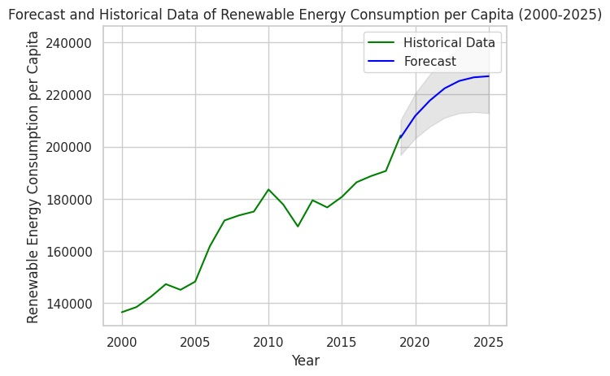

1.	What is the current CO2 emission situation?

Figure 1. Average Growth of CO2 Emissions Over the Years

Figure 2. Top 5 Countries with Highest Average CO2 Emissions
China has the highest energy consumption and has kept increasing recently, reaching 169205kT in the last year.

2.	Which is the best model, among linear regression, random forest, and gradient boosting, that fits the prediction curve concerning renewable energy consumption in Asia?

Figure 3. Energy Consumption per Capita by Region

The above graph clearly shows the trends in per capita energy consumption by continent. The graphs are quite different from each other.
Asia has experienced a steady increase in per capita energy consumption over the years, making it a noteworthy region for study. Asia is on the verge of potentially surpassing Europe in terms of per capita energy consumption. This upward trend suggests that Asia's energy consumption patterns are undergoing significant changes, which could have far-reaching implications for both regional and global energy markets.

Figure 4. Heatmap based on Asian data
The related features for predicting and forecasting are:

|Indicator|values|
|-------|----|
|Renewable-electricity-generating-capacity-per-capita|0.845629|
|Low-carbon electricity (% electricity)|0.510221|
|Longitude         |   0.187992|
|gdp_per_capita         |       0.154445|
|The energy intensity level of primary energy (MJ/$2017 PPP GDP) | 0.109001|

After training and testing the models, the Random Forest model has the lowest MSE and the highest R-squared value, indicating it is the best performer among the three for this particular dataset and set of features. It not only predicts with the least error (as indicated by MSE) but also explains the most variance in the target variable (as indicated by R²).

Figure 5. prediction evaluation
What is the future trend of renewable energy consumption going like in Asia?

While Random Forest can make future predictions, these are based on the assumption that future conditions will mirror past patterns captured in the training data. It does not model time-based trends or seasonality inherently. Therefore, VAR is applied here to forecast the future trend, which is explicitly designed for forecasting in multivariate time series.

Figure 6. VAR forecasting on features and target
VAR model forecasts that renewable energy consumption will keep increasing and will reach 225253 kT per capita per year in 2025.

Figure 7. Forecast and Historical Data of Renewable Energy Consumption per Capita (2000-2025)
This figure shows the Historical and Forecast Data of Renewable Energy Consumption per Capita. The Forecast Data also includes a 95% Confidence Interval.
You can see that energy consumption in Asia is not a smooth curve. So, this may be related to the impact of policy release, then further research may be able to use causal influence to study the impact of policy release on energy consumption.

