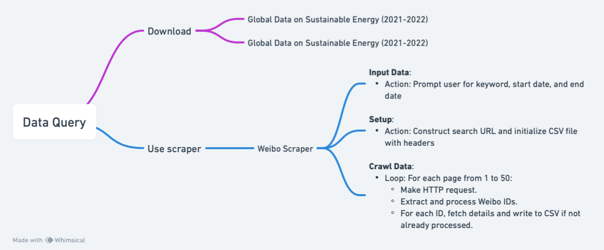

Data section includes data query and data analysis.

## Data Querying
  The main part of the data was directly downloaded from
1.	 https://www.kaggle.com/datasets/anshtanwar/global-data-on-sustainable-energy, which is an open data source sorted by Ansh Tanwar. 
2.	 New data for 2021-2022 from the World Bank https://datacatalog.worldbank.org/search/dataset/0037712/World-Development-Indicators

  Additionally, there is also a data query code for the Weibo platform, which is all written by me. This program crawls posts from the social media platform we want by keyword and time period, including the content of the post, user name, when it was posted, where it was posted, and so on. See the code below.


### Code
Two Ways to access it:
1. See ipynb code uploaded to Github [here](https://github.com/Rising-Stars-by-Sunshine/STATS201_Yiming_PS2/tree/main/code/data%20query).
2. [Link for code in CoLab](https://colab.research.google.com/drive/1GVRQS_lPPvG4PGDtL9XREuSXiEv3eQit?usp=sharing)

###  pseudo-code
```
Create a class named Demo

In the Demo class:
1. Prompt user to input keyword, start date, and end date.
2. Construct a search URL using the input keyword and date range.
3. Define headers and cookie for the HTTP requests.

4. Initialize an empty list to store crawled Weibo IDs.
5. Open (or create) a CSV file named after the input keyword.
6. Write header row in the CSV file: ['mid', 'Content', 'Post Location', 'Post Time', 'Likes', 'Reposts', 'Comments'].

Define a method start in the Demo class:
    For each page from 1 to 50:
        a. Construct a new URL by appending the page number to the base search URL.
        b. Make an HTTP GET request to the new URL with the defined headers.
        c. Extract Weibo post IDs using regular expressions from the response.
        d. For each extracted Weibo ID:
            i. If the ID is not already in the list of crawled IDs:
                - Add the ID to the list.
                - Pause for 2 seconds (to prevent blocking).
                - Make an HTTP GET request to fetch detailed data of the Weibo post.
                - Extract data: ID, content, location, time, likes, reposts, comments.
                - Write the extracted data to the CSV file.

When the script is run:
    - Create an instance of the Demo class.
    - Call the start method on the instance.
```

### flowchart



## Data Analysis

### Methodology:
1. Data Preparation

2. CO2 Emission Situation 

3. Classification: by Region

4. Indicator Correlation
- Animation on a World map
- Heatmap
- Scatterplot

5. Prediction
- Linear Regression
- Random Forest
- Gradient Boosting

### Code

**Data Process**
Two Ways to access it:
1. See py code uploaded to Github [here]()
2.  [Link for code in CoLab](https://colab.research.google.com/drive/14pV7HPZY4tLFAsLHBs_Tk4hbmpbAdEHz?usp=sharing)

**Data Analysis**
Two Ways to access it:
1. See py code uploaded to Github [here](https://github.com/Rising-Stars-by-Sunshine/STATS201_Yiming_Research-Proposal/blob/main/code/data%20analysis/data_analysis.py).

2. [Link for code in CoLab](https://colab.research.google.com/drive/1EiOV6f8YtB9a-EhkOMJPLavm6NkIdkfg?usp=sharing)
