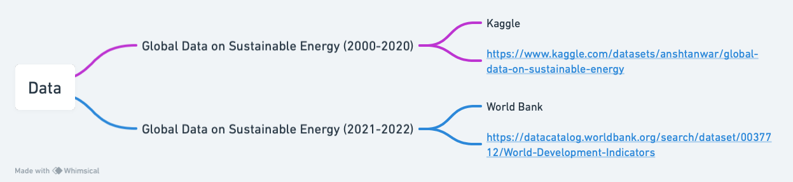

## Description
This dataset is mainly queried from Kaggle (https://www.kaggle.com/datasets/anshtanwar/global-data-on-sustainable-energy), which is an open data source sorted by Ansh Tanwar. It showcases sustainable energy indicators and other useful factors across countries from 2000 to 2020. We can dive into vital aspects such as renewable energy, energy intensity, financial flows, and economic growth; and gain profound insights into global energy consumption patterns by comparisons. 

Considering the completeness and real-time nature of the data, I downloaded new data for 2021-2022 from the World Bank (https://datacatalog.worldbank.org/search/dataset/0037712/World-Development-Indicators).

I also wrote a code to scrape data from Weibo, the data will include post texts, posting time, location, etc.. It will be applied in the causal inference part, which can indicate public feelings on policy launching.

## Sample Data

|Entity	|Year	|Access to electricity (% of population)	|Access to clean fuels for cooking|	Renewable-electricity-generating-capacity-per-capita | Financial flows to developing countries (US $)|	Renewable energy share in the total final energy consumption (%)|	Electricity from fossil fuels (TWh) | Electricity from nuclear (TWh) |	Electricity from renewables (TWh) |	Low-carbon electricity (% electricity) | Primary energy consumption per capita (kWh/person)	|Energy intensity level of primary energy (MJ/$2017 PPP GDP)|	Value co2 emissions kt by country |	Renewables (% equivalent primary energy)|	gdp_growth|	gdp_per_capita	|Density\n(P/Km2)	|Land Area(Km2)	|Latitude|	Longitude|
|--------|---------|--------|-------|---------|--------|--------|--------|--------|--------|-------|---------|--------|--------|--------|--------|--------|-------|---------|--------|--------|
| Afghanistan|	2000|	1.613591|	6.2	|9.22	|20000|	44.99	|0.16|	0	|0.31|	65.95744|	302.59482	|1.64|	760		||||		60	|652230	|33.93911	|67.709953|
|Afghanistan|	2001	|4.074574|	7.2	|8.86|	130000	|45.6|	0.09|	0	|0.5|	84.745766|	236.89185	|1.74	|730	||||			60	|652230|	33.93911	|67.709953|
|Afghanistan|	2002	|9.409158	|8.2|	8.47	|3950000|	37.83|	0.13|	0	|0.56|	81.159424	|210.86215|	1.4|	1029.999971	|	||	179.4265792|	60|	652230	|33.93911	|67.709953|
|Afghanistan|	2003|	14.738506	|9.5|	8.09|	25970000	|36.66|	0.31|	0	|0.63|	67.02128|	229.96822|	1.4|	1220.000029|	|	8.832277813	|190.6838143|	60	|652230|	33.93911	|67.709953|
|Afghanistan	|2004|	20.064968	|10.9|	7.75	||	44.24|	0.33|	0	|0.56|	62.92135	|204.23125	|1.2|	1029.999971||		1.414117981|	211.3820742|	60|	652230	|33.93911|	67.709953|

It is apparent to find that there exist null data, which should be cleaned before analysis.

See Data Dictionary in [DataDictionary.md](https://github.com/Rising-Stars-by-Sunshine/STATS201_Yiming_PS2/blob/main/data/DataDictionary.md#data-dictionary-for-your-dataset-name)

## flowchart

