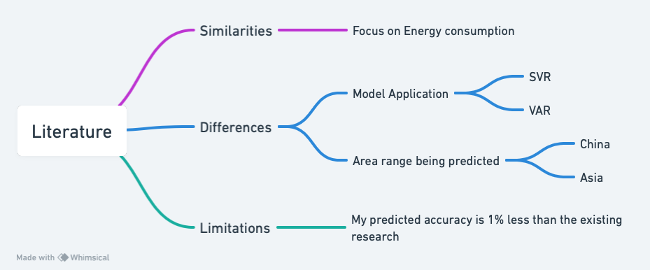

The existing research uses the SVR model for forecasting energy consumption, focused on China (Meng et al., 2022). In my research, I apply the VAR model for forecasting renewable energy consumption in Asia, which covers a larger area. VAR is especially useful for forecasting interrelated time series and analyzing the dynamic impact of random disturbances, which means it can capture the relationship between several variables over time. However, the prediction accuracy of 97.5% is a bit lower than the existing research, which is possibly because of the diversity in Asian countries.

**Flowchart**

